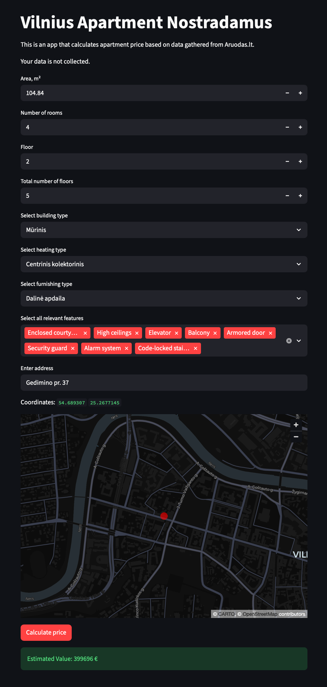

# Apartment Prices in Vilnius

This is a Python data scraping and analysis project with Selenium & Pandas.

The main goal of this project is to **predict** apartment prices in Vilnius based on area, floor, location, proximity to amenities and text descriptions in listings.

The data was scraped from [Aruodas.lt](https://aruodas.lt/), the most popular Lithuanian real estate marketplace.

Achieved outcomes:

- an XGBoost model that achieves an R2 of 0.874 and RMSLE of 0.26; 

- best apartment price predicting variables were area, area per room, distance to bus stop, kindergarden & school and local population;

- the current model could be further improved by extracting missing categorical features from text.

The XGBoost model is deployed on [Heroku](https://vilnius-nostradamus-095f0ef45495.herokuapp.com/).

AI was used for debugging purposes and model variable preparation in deployment app.